

Welcome to my profile and portfolio, where I cultivate and maintain all my work as an Open Source Programmer. Feel free to take a look. It's a pleasure to have you here! 🙂

## 

Tools I Work With

  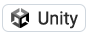 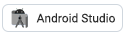   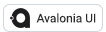  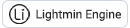    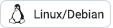  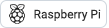    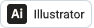  

 

Languages ​​I Work With

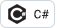 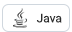  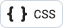 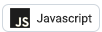   

##
 

