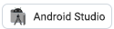
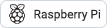

Welcome to my profile and portfolio, where I cultivate and maintain all my work as an Open Source Programmer. Feel free to take a look. It's a pleasure to have you here! 🙂

##

Tools/Services I Work With

                     

Languages/Schemas ​​I Work With

        

##

Published/Distributed Works On

     

##

